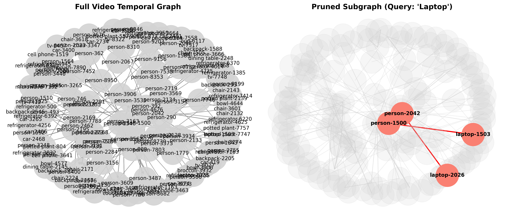
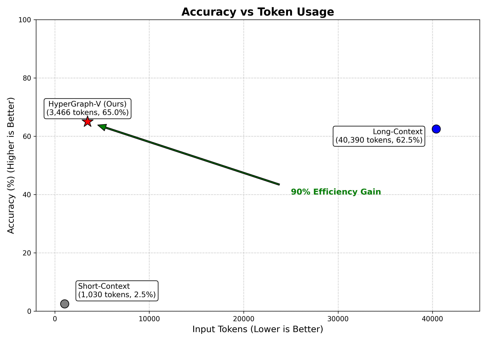

# Semantic Event Graphs for Long-Form Video Reasoning

**WACV Paper Submission Codebase (ACCEPTED) **
Paper: https://arxiv.org/abs/2601.06097

This repository implements the **Temporal Scene Graph** approach for efficient long-form video question answering. By representing video events as a structured graph and pruning irrelevant nodes based on user queries, we achieve **>90% reduction in token usage** while maintaining or improving accuracy compared to full-context baselines.



## 🚀 Key Results

| Strategy | Tokens (Avg) | Accuracy | Cost Reduction |
| :--- | :--- | :--- | :--- |
| **Short Context** (30s) | ~1,030 | 2.5% | - |
| **Long Context** (Full) | ~40,390 | 62.5% | - |
| **HyperGraph** (Ours) | **~3,466** | **65.0%** | **91.4%** |


_Figure 2: Performance Trade-off (Accuracy vs. Input Tokens). The plot illustrates the Pareto efficiency of the Semantic Event Graph (HyperGraph) method. While the Short-Context model is cheap but inaccurate, the Full Log Baseline is accurate but requires processing over 40k tokens. TSG effective breaks the traditional trade-off._

## 📂 Directory Structure

```
├── data/               # Input data
│   ├── videos/         # Place .mp4 files here
│   └── models/         # YOLO weights (yolo11n.pt, etc.)
├── src/                # Core library code
│   ├── temporal_graph.py  # Graph logic & pruning
│   ├── llm_judge.py       # Semantic evaluation with Gemini
│   └── graphmemory/       # Scene graph extraction logic
├── scripts/            # Executable workflow scripts
│   ├── batch_process.py
│   ├── generate_benchmark.py
│   ├── run_full_evaluation.py
│   └── visualize_graph.py
├── outputs/            # Generated artifacts
│   ├── logs/           # Extracted event logs (.json)
│   ├── benchmark_data.json
│   └── final_results.json
└── events_log.json     # Sample event log
```

## 🛠️ Installation

1.  **Clone the repository**
2.  **Install Dependencies**:
    ```bash
    pip install -r requirements.txt
    ```
    *Core requirements: `opencv-python`, `ultralytics`, `networkx`, `google-generativeai`, `matplotlib`.*
3.  **Set API Key**:
    ```bash
    export GEMINI_API_KEY='your_api_key_here'
    ```

## ⚡ Usage Pipeline

To reproduce the full evaluation pipeline from scratch:

### 1. Extract Event Logs
Process raw video files into semantic event logs.
```bash
python scripts/batch_process.py
```
*Input: `data/videos/*.mp4`*
*Output: `outputs/logs/*_events.json`*

### 2. Generate Benchmark (Ground Truth)
Use the LLM to generate hard, long-form queries based on the full event logs.
```bash
python scripts/generate_benchmark.py
```
*Output: `outputs/benchmark_data.json`*

### 3. Run Evaluation
Compare "Short", "Long", and "HyperGraph" strategies.
```bash
python scripts/run_full_evaluation.py
```
*Output: `outputs/final_results.json`*

### 4. Visualization
Generate the graph pruning visualization (Figure 1 in paper).
```bash
python scripts/visualize_graph.py
```
*Output: `outputs/figure_1_teaser.png`*

## 🔍 Debugging
To inspect the pipeline logic or log file contents:
```bash
python scripts/debug_pipeline.py
```

## 🧠 Methodology
1.  **Scene Graph Generation**: Detects objects (YOLO) and tracks spatial interactions (IoU/distance) over time.
2.  **Temporal Graph**: Nodes = Objects/Persons; Edges = Interactions with timestamps.
3.  **Specific Priority Pruning**:
    *   **Anchors**: Identify query-relevant nodes. Prioritizes specific IDs (e.g., `person-1`) over generic classes.
    *   **Expansion**: Retrieve 1-hop neighbors (all interactions of anchors).
    *   **Reasoning**: Feed only the pruned narrative to the LLM.

## 📄 License
MIT License
